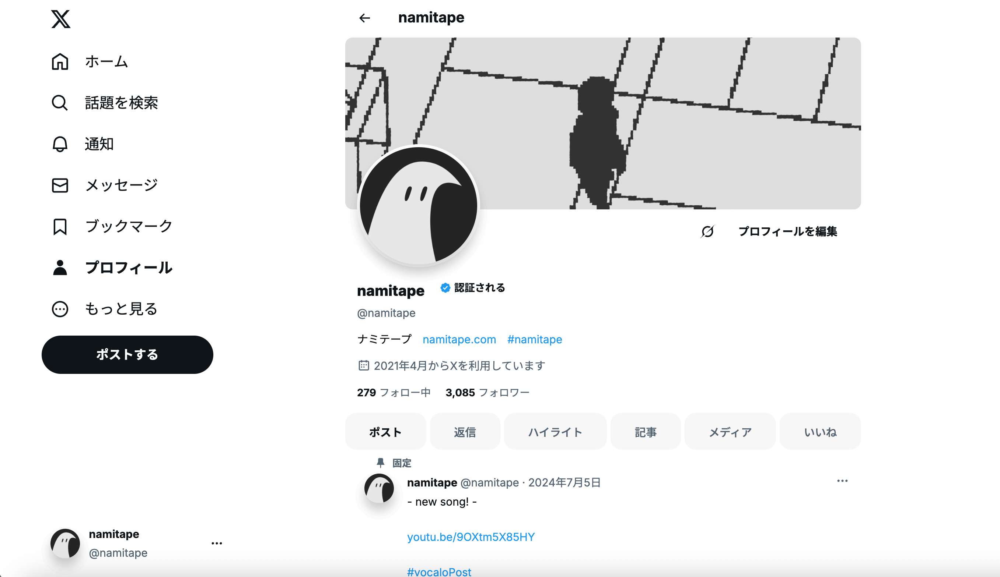
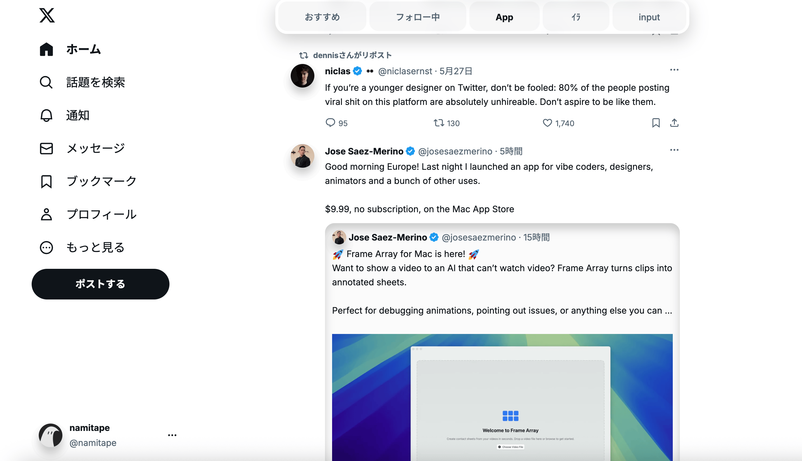

# TapeCSS
x.comをより柔らかいデザインにするGoogleChrome拡張機能。

## インストール方法
1. 右上の「<>Code」を押してダウンロード
2. ダウンロードされたzipファイルを展開
3. chromeの右上の...から拡張機能 > 拡張機能を管理　をクリック
4. 拡張機能ページの右上、デベロッパーモードをONにする
5. 「パッケージ化されていない拡張機能を読み込む」をクリック
6. 先ほど展開したファイルを選択する

## 壊れている
- 検索候補が隠れる
- ツイートとそのリプライが表示されるページでブックマークのアイコンが消滅
- いいねのアニメーションが大きい

## プレビュー

